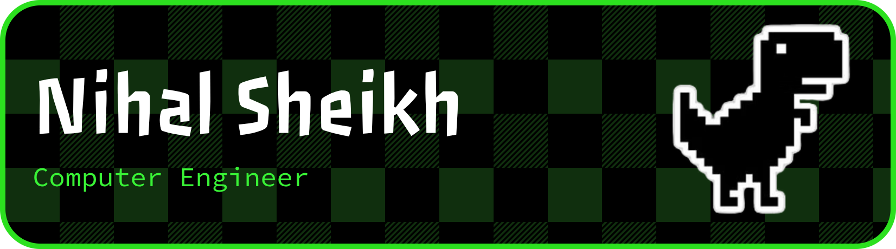

<!-- BANNER GIF -->

    

<!-- Titles -->
<!-- 

  

 -->

 

<!-- Get in Touch -->

    
    
    
    
    

---

<!-- About Me -->
<!-- <h3 style="color:red; font-family:'JetBrains Mono'"> 👨‍💻 About Me:</h3>

<ul>

-   💫 Exploring _Cloud_ **/** _DevOps_ **/** _Web3_

-   💡 Exploring new projects ideas

-   👀 AI, Web3 and Blockchain enthusiast

-   🚀 Sharing my learnings and grinding on [`Twitter`](https://x.com/sshNihal).

-   🔭 Currently working on _**Web2**_ and _**Web3**_ Projects

</ul> -->

<!-- --- -->

<!--TECHSTACK WITH IMAGE ICONS ADDED HERE -->

### ⚙️ Tech Stack:

|  |                                                                                                                                                        |                                   |                                |                                                                                                                                                      |
| -------------------------------------------------------------------------------------------------------------------------------------------------- | ---------------------------------------------------------------------------------------------------------------------------------------------------------------------------------------------------------------------------------------------------------------------------------------------- | ------------------------------------------------------------------------------------------------------------------------------------------------------------------------------- | -------------------------------------------------------------------------------------------------------------------------------------------------------------------------------- | -------------------------------------------------------------------------------------------------------------------------------------------------------------------------------------------------------------------------------------------------------------------------------------------------- |
|                                                                |        |     |     |        |

---

 
<!-- GitHub Stats -->
<!-- 

|  | - |
| - |

 -->

<!-- GitHub Card -->
<!--  -->

|  |  |
| ---------------------------------------------------------------------------------------------------------------------------------------------- | ------------------------------------------------------------------------------------------------------------------------------------------------------------------------- |

<!-- readme file ends here ~ nihalsheikh-->
