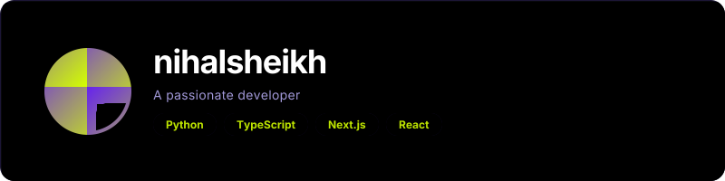
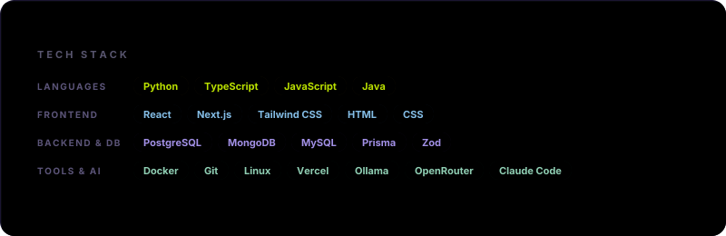

## `> whoami`

```python
class NihalSheikh:
    pronouns     = "he/him"
    location     = "Nagpur, India 🇮🇳"
    education    = "B.E. Computer Engineering — G.H. Raisoni, Pune (2024)"
    currently    = ["Building SnippetVault 🗂️", "Open to full-time & freelance roles 🚀"]
    interests    = ["Full-Stack Dev", "Systems Programming", "Local LLMs", "Open Source"]
    fun_fact     = "Daily-drives Ubuntu + Hackintosh on an ASUS TUF. Hostname: aincrad."
    fueled_by    = "Chai and compiler errors ☕"
```

***

## `> cat stats.json`

<div align="center">

|  |  |
| :-----------------------------------------------------------------------------------------------------------------------------------------------------------------------------------------------------------------------------------------------: | :--------------------------------------------------------------------------------------------------------------------------------------------------------------------------------------------: |

<br/>


</div>

***

<p align="center">
<a href="https://x.com/sshNihal"></a><a href="https://www.linkedin.com/in/nihalsheikh/"></a><a href="https://flowcv.me/nihalsheikh"></a><a href="mailto:nihalsheikh585@gmail.com"></a>
</p>

<br>
<p align="center"><sub>built with <a href="https://github.com/collectioneur/readme-aura">readme-aura</a> · nihalsheikh</sub></p>
