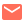

```aura width=860 height=200
<div style={{
  width:'100%',
  height:'100%',
  background:'#08080c',
  display:'flex',
  alignItems:'center',
  fontFamily:'Inter',
  position:'relative',
  overflow:'hidden',
  borderRadius:16,
  border:'1px solid rgba(120,130,255,0.10)',
}}>

  <style>{`
    @keyframes float-slow {
      0%,100% { transform:translateX(0px); opacity:0.55; }
      50% { transform:translateX(320px); opacity:0.85; }
    }

    @keyframes float-medium {
      0%,100% { transform:translateX(0px); opacity:0.45; }
      50% { transform:translateX(-220px); opacity:0.75; }
    }

    @keyframes float-fast {
      0%,100% { transform:translateX(0px); opacity:0.50; }
      50% { transform:translateX(170px); opacity:0.30; }
    }

    @keyframes float-wave {
      0%,100% { transform:translateX(0px); opacity:0.45; }
      33% { transform:translateX(-120px); opacity:0.65; }
      66% { transform:translateX(60px); opacity:0.80; }
    }

    @keyframes pulse {
      0%,100% { transform:scale(1); opacity:0.45; }
      50% { transform:scale(1.18); opacity:0.18; }
    }

    #glow-1 { animation: float-slow 9s ease-in-out infinite; }
    #glow-2 { animation: float-medium 13s ease-in-out infinite; }
    #glow-3 { animation: float-fast 10s ease-in-out infinite; }
    #glow-4 { animation: float-wave 15s ease-in-out infinite; }
    #glow-5 { animation: pulse 8s ease-in-out infinite; }
  `}</style>

  <svg
    width="860"
    height="200"
    style={{
      position:'absolute',
      top:0,
      left:0,
      display:'flex',
    }}
  >
    <defs>

      <radialGradient id="g1">
        <stop offset="0%" stopColor="rgba(110,130,255,0.30)" />
        <stop offset="70%" stopColor="rgba(110,130,255,0)" />
      </radialGradient>

      <radialGradient id="g2">
        <stop offset="0%" stopColor="rgba(80,160,255,0.22)" />
        <stop offset="70%" stopColor="rgba(80,160,255,0)" />
      </radialGradient>

      <radialGradient id="g3">
        <stop offset="0%" stopColor="rgba(160,180,255,0.18)" />
        <stop offset="70%" stopColor="rgba(160,180,255,0)" />
      </radialGradient>

      <radialGradient id="g4">
        <stop offset="0%" stopColor="rgba(120,140,255,0.20)" />
        <stop offset="70%" stopColor="rgba(120,140,255,0)" />
      </radialGradient>

      <radialGradient id="g5">
        <stop offset="0%" stopColor="rgba(90,190,255,0.16)" />
        <stop offset="70%" stopColor="rgba(90,190,255,0)" />
      </radialGradient>

    </defs>

    <ellipse id="glow-1" cx="170" cy="210" rx="250" ry="180" fill="url(#g1)" />
    <ellipse id="glow-2" cx="340" cy="220" rx="210" ry="150" fill="url(#g2)" />
    <ellipse id="glow-3" cx="500" cy="220" rx="180" ry="130" fill="url(#g3)" />
    <ellipse id="glow-4" cx="660" cy="220" rx="200" ry="150" fill="url(#g4)" />
    <ellipse id="glow-5" cx="520" cy="200" rx="140" ry="120" fill="url(#g5)" />

  </svg>

  <div style={{
    display:'flex',
    alignItems:'center',
    paddingLeft:48,
    paddingRight:40,
    width:'100%',
  }}>

    <div style={{
      display:'flex',
      marginRight:28,
      width:96,
      height:96,
      borderRadius:48,
      background:'rgba(255,255,255,0.04)',
      border:'1px solid rgba(255,255,255,0.08)',
      alignItems:'center',
      justifyContent:'center',
      flexShrink:0,
    }}>
      
    </div>

    <div style={{
      display:'flex',
      flexDirection:'column',
      gap:8,
    }}>

      <div style={{
        display:'flex',
        fontSize:38,
        fontWeight:800,
        color:'#ffffff',
        letterSpacing:'-1px',
        lineHeight:1,
      }}>
        {github.user.name || github.user.login}
      </div>

      <div style={{
        display:'flex',
        fontSize:15,
        color:'rgba(205,210,255,0.70)',
        fontWeight:400,
      }}>
        {github.user.bio || 'Full-Stack Engineer · Open Source Builder'}
      </div>

      <div style={{
        display:'flex',
        gap:8,
        marginTop:4,
      }}>

        {['React','TypeScript','Next.js','Python'].map(function(tag) {
          return (
            <div
              key={tag}
              style={{
                display:'flex',
                padding:'4px 12px',
                borderRadius:20,
                background:'rgba(255,255,255,0.04)',
                border:'1px solid rgba(255,255,255,0.08)',
                color:'rgba(225,230,255,0.82)',
                fontSize:12,
                fontWeight:600,
              }}
            >
              {tag}
            </div>
          );
        })}

      </div>

    </div>

  </div>

</div>
```

```aura width=860 height=140
(function() {

 var stats = [
   {
     label:'Repos',
     value:String(github.stats.totalRepos),
     color:'rgba(180,190,255,0.92)'
   },
   {
     label:'Stars',
     value:String(github.stats.totalStars),
     color:'rgba(120,190,255,0.92)'
   },
   {
     label:'Commits',
     value:String(github.stats.totalCommits),
     color:'rgba(255,210,140,0.92)'
   },
 ];

 return (
   <div style={{
     width:'100%',
     height:'100%',
     background:'#08080c',
     display:'flex',
     alignItems:'center',
     justifyContent:'center',
     fontFamily:'Inter',
     borderRadius:16,
     border:'1px solid rgba(120,130,255,0.10)',
     position:'relative',
     overflow:'hidden',
   }}>

     <style>{`
       @keyframes drift-a {
         0%,100% { transform:translateX(0px); opacity:0.45; }
         50% { transform:translateX(220px); opacity:0.75; }
       }

       @keyframes drift-b {
         0%,100% { transform:translateX(0px); opacity:0.35; }
         50% { transform:translateX(-160px); opacity:0.65; }
       }

       #bg-a { animation: drift-a 12s ease-in-out infinite; }
       #bg-b { animation: drift-b 15s ease-in-out infinite; }
     `}</style>

     <svg
       width="860"
       height="140"
       style={{
         position:'absolute',
         top:0,
         left:0,
         display:'flex',
       }}
     >

       <defs>

         <radialGradient id="sg1">
           <stop offset="0%" stopColor="rgba(120,140,255,0.22)" />
           <stop offset="70%" stopColor="rgba(120,140,255,0)" />
         </radialGradient>

         <radialGradient id="sg2">
           <stop offset="0%" stopColor="rgba(80,180,255,0.18)" />
           <stop offset="70%" stopColor="rgba(80,180,255,0)" />
         </radialGradient>

       </defs>

       <ellipse id="bg-a" cx="640" cy="150" rx="240" ry="160" fill="url(#sg1)" />
       <ellipse id="bg-b" cx="220" cy="130" rx="220" ry="140" fill="url(#sg2)" />

     </svg>

     {stats.map(function(s, i) {

       return (
         <div
           key={s.label}
           style={{
             flexGrow:1,
             display:'flex',
             flexDirection:'column',
             alignItems:'center',
             justifyContent:'center',
             padding:'16px 8px',
             borderRight:i < stats.length - 1
               ? '1px solid rgba(255,255,255,0.05)'
               : 'none',
             gap:5,
           }}
         >

           <div style={{
             display:'flex',
             fontSize:30,
             fontWeight:800,
             color:s.color,
             lineHeight:1,
           }}>
             {s.value}
           </div>

           <div style={{
             display:'flex',
             fontSize:11,
             color:'rgba(210,215,255,0.42)',
             fontWeight:600,
             letterSpacing:'1.5px',
           }}>
             {s.label.toUpperCase()}
           </div>

         </div>
       );

     })}

   </div>
 );

})()
```

```aura width=860 height=168
(function() {

 var topLangs = github.languages
   .slice(0, 6)
   .map(function(l) { return l.name; });

 var categories = [
   {
     title:'Languages',
     color:'rgba(180,190,255,0.92)',
     items:topLangs
   },
   {
     title:'Frameworks',
     color:'rgba(120,190,255,0.92)',
     items:['React','Next.js','Tailwind CSS']
   },
   {
     title:'Tools',
     color:'rgba(255,210,140,0.92)',
     items:['Git','Docker','Linux']
   },
 ];

 return (
   <div style={{
     width:'100%',
     height:'100%',
     background:'#08080c',
     display:'flex',
     flexDirection:'column',
     fontFamily:'Inter',
     padding:'20px 32px',
     gap:14,
     borderRadius:16,
     border:'1px solid rgba(120,130,255,0.10)',
     position:'relative',
     overflow:'hidden',
   }}>

     <style>{`
       @keyframes move-a {
         0%,100% { transform:translateX(0px); opacity:0.45; }
         50% { transform:translateX(260px); opacity:0.70; }
       }

       @keyframes move-b {
         0%,100% { transform:translateX(0px); opacity:0.35; }
         50% { transform:translateX(-180px); opacity:0.60; }
       }

       #tech-a { animation: move-a 13s ease-in-out infinite; }
       #tech-b { animation: move-b 16s ease-in-out infinite; }
     `}</style>

     <svg
       width="860"
       height="168"
       style={{
         position:'absolute',
         top:0,
         left:0,
         display:'flex',
       }}
     >

       <defs>

         <radialGradient id="tg1">
           <stop offset="0%" stopColor="rgba(120,140,255,0.22)" />
           <stop offset="70%" stopColor="rgba(120,140,255,0)" />
         </radialGradient>

         <radialGradient id="tg2">
           <stop offset="0%" stopColor="rgba(80,180,255,0.18)" />
           <stop offset="70%" stopColor="rgba(80,180,255,0)" />
         </radialGradient>

       </defs>

       <ellipse id="tech-a" cx="200" cy="180" rx="260" ry="160" fill="url(#tg1)" />
       <ellipse id="tech-b" cx="620" cy="170" rx="240" ry="150" fill="url(#tg2)" />

     </svg>

     <div style={{
       display:'flex',
       fontSize:10,
       fontWeight:700,
       color:'rgba(200,205,255,0.40)',
       letterSpacing:'3px',
     }}>
       TECH STACK
     </div>

     <div style={{
       display:'flex',
       flexDirection:'column',
       gap:14,
     }}>

       {categories.map(function(cat) {

         return (
           <div
             key={cat.title}
             style={{
               display:'flex',
               alignItems:'center',
               gap:16,
             }}
           >

             <div style={{
               display:'flex',
               width:84,
               fontSize:10,
               fontWeight:700,
               color:cat.color,
               letterSpacing:'1px',
             }}>
               {cat.title.toUpperCase()}
             </div>

             <div style={{
               display:'flex',
               flexWrap:'wrap',
               gap:7,
             }}>

               {cat.items.map(function(item) {

                 return (
                   <div
                     key={item}
                     style={{
                       display:'flex',
                       padding:'4px 13px',
                       borderRadius:10,
                       background:'rgba(255,255,255,0.04)',
                       border:'1px solid rgba(255,255,255,0.08)',
                       color:'rgba(230,235,255,0.85)',
                       fontSize:12,
                       fontWeight:600,
                     }}
                   >
                     {item}
                   </div>
                 );

               })}

             </div>

           </div>
         );

       })}

     </div>

   </div>
 );

})()
```

```aura width=120 height=44 link="https://www.linkedin.com/in/nihalsheikh/" inline align=center
<div style={{
  width:'100%',
  height:'100%',
  display:'flex',
  alignItems:'center',
  justifyContent:'center',
  gap:7,
  fontFamily:'Inter',
  borderRadius:22,
  background:'#0d0d0d',
  border:'1px solid rgba(120,190,255,0.22)',
}}>
  
  <div style={{
    display:'flex',
    fontSize:13,
    fontWeight:600,
    color:'rgba(180,210,255,0.92)',
  }}>
    LinkedIn
  </div>
</div>
```

```aura width=138 height=44 link="https://x.com/sshNihal" inline align=center
<div style={{
  width:'100%',
  height:'100%',
  display:'flex',
  alignItems:'center',
  justifyContent:'center',
  gap:7,
  fontFamily:'Inter',
  borderRadius:22,
  background:'#0d0d0d',
  border:'1px solid rgba(180,190,255,0.18)',
}}>
  
  <div style={{
    display:'flex',
    fontSize:13,
    fontWeight:600,
    color:'rgba(220,225,255,0.88)',
  }}>
    X / Twitter
  </div>
</div>
```

```aura width=128 height=44 link="https://flowcv.me/nihalsheikh" inline align=center
<div style={{
  width:'100%',
  height:'100%',
  display:'flex',
  alignItems:'center',
  justifyContent:'center',
  gap:7,
  fontFamily:'Inter',
  borderRadius:22,
  background:'#0d0d0d',
  border:'1px solid rgba(170,180,255,0.18)',
}}>
  
  <div style={{
    display:'flex',
    fontSize:13,
    fontWeight:600,
    color:'rgba(225,230,255,0.88)',
  }}>
    Portfolio
  </div>
</div>
```

```aura width=106 height=44 link="mailto:nihalsheikh585@gmail.com" inline align=center
<div style={{
  width:'100%',
  height:'100%',
  display:'flex',
  alignItems:'center',
  justifyContent:'center',
  gap:7,
  fontFamily:'Inter',
  borderRadius:22,
  background:'#0d0d0d',
  border:'1px solid rgba(255,210,140,0.18)',
}}>
  
  <div style={{
    display:'flex',
    fontSize:13,
    fontWeight:600,
    color:'rgba(255,220,170,0.90)',
  }}>
    Email
  </div>
</div>
```

<br>

<p align="center">
  <sub>
    nihalsheikh
    · fueled by chai and compile errors
  </sub>
</p>
